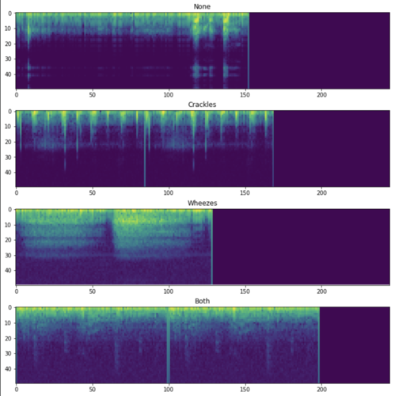
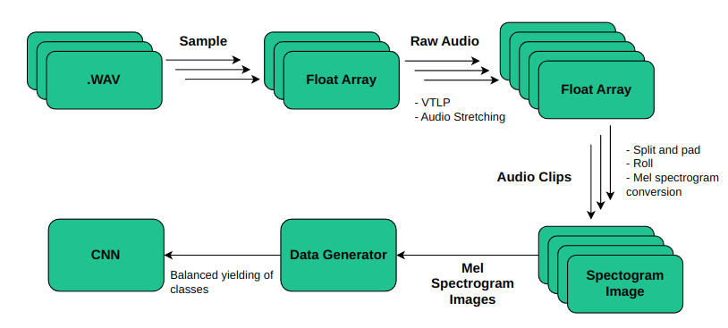
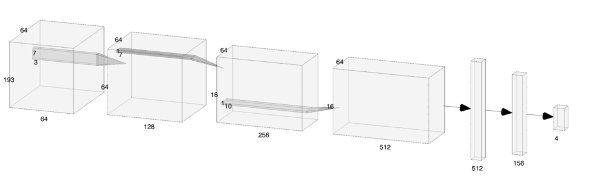
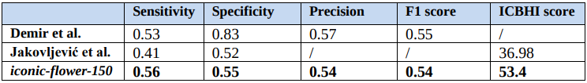
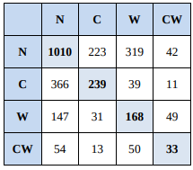

Respiratory Anomaly Classifier [2019]
==============================
This repository contains the code for training and evaluation of Convolutional 
Neural Network (CNN) for detection of respiratory anomalies. [Training pipeline]((#some-markdown-heading)),
[CNN architecture](#cnn-architecture) and [Results](#results) are described below.



*Respiratory anomaly sounds in spectrogram form*

# Problem And Motivation
Respiratory sounds are important indicators of respiratory health and 
respiratory disorders. Anomalous sounds such as crackles and wheezing sounds, 
for example, are a common sign that a patient has an obstructive airway 
disease like asthma, chronic obstructive pulmonary disease (COPD), etc.

# Dataset
[The Respiratory Sound Database](https://bhichallenge.med.auth.gr/) was 
created by two research teams in Portugal and Greece. It includes 920 annotated 
recordings of varying length - 10s to 90s. These recordings were taken from 
126 patients. There are a total of 5.5 hours of recordings containing 6898 
respiratory cycles: 
   - 3642 healthy
   - 1864 contain crackles
   - 886 contain wheezes
   - 506 contain both crackles and wheezes
   
# Training pipeline


*Simplified training pipeline*


# CNN Architecture


*CNN Architecture - Some layers omitted for simplicity*

Explained intuition behind every layer in CNN architecture: 
 1. **Conv2D(64, [7,3])** - “Denoising and basic feature extraction step”
 2. **MaxPool([1,3])** - “Getting back down to [N] frequency features, where 
 N represents the number of mel filterbanks divided by 3”
 3. **Conv2D(128, [1,7])** - “Local pattern recognition across frequency bands”
 4. **MaxPool([1,4])** - “Allow patient audio variation, similar to what 
 worked for speech in [this paper](https://link.springer.com/content/pdf/10.1186%2Fs13636-015-0068-3.pdf)"
 5. **Conv2D(256, [1,10])** -“Feature extraction for each of frequency bands 
 differently and compressing frequency dimension”
 6. **Conv2D(512, [7,1])** - “Looking for connected patterns in a short 
 timeframe”
 7. **GlobalMaxPool** - “Connecting all components”
 8. **Dense(256) + Dropout** - “Feature interpretation”
 9. **Dense(4) + Softmax** - “Output layer"


# Results
Best performing model codenamed **“iconic-flower-150”** achieves performance 
comparable to previous SOTA approaches, especially notable on difficult official 
ICBHI test-train split.



*Results comparison*

# Error analysis
Most of the mistakes model makes are misclassifications of crackle **[C]** 
sounds with healthy **[N]** sounds which can be seen on confusion matrix:



*Confusion matrix*

# Running instructions
1. `git clone git@github.com:nikola-ai/respiratory-anomaly-detection.git`
2. Create virtual environment: `virtualenv -p python3.8 env`
3. Activate virtual environment: `source env/bin/activate`
4. Install requirements: `pip install -r requirements.txt`
5. Download and extract ICBHI dataset to `/data/raw/`
6. Run: `python ./src/train_cnn.py`

# Running options
```bash
usage: train_cnn.py [-h] [-sr SAMPLE_RATE] [-tsr TARGET_SAMPLE_RATE] [-sl SAMPLE_LENGTH] [-wt WINDOW_TYPE] [-wl WINDOW_LENGTH]
                    [-ws WINDOW_STEP] [-nf N_FILTERS] [-lfc LOW_FREQ_CUTOFF] [-hfc HIGH_FREQ_CUTOFF] [-sw SAMPLE_WIDTH] [-sh SAMPLE_HEIGHT]
                    [-vtlp_mf VTLP_UPPER_FREQ_MIN] [-vtlp_hf VTLP_UPPER_FREQ_MAX] [-t SAMPLE_TILING] [-mg GPU_MEM_GROW] [-se SE_THRESH]
                    [-sp SP_THRESH] [-m MODEL_NAME] [-d DEMO_MODE] [-lr LEARNING_RATE] [-b BATCH_SIZE] [-e N_EPOCHS]

optional arguments:
  -h, --help            show this help message and exit
  -sr SAMPLE_RATE, --sample_rate SAMPLE_RATE
                        Sampling rate
  -tsr TARGET_SAMPLE_RATE, --target_sample_rate TARGET_SAMPLE_RATE
                        Target sample rate
  -sl SAMPLE_LENGTH, --sample_length SAMPLE_LENGTH
                        Sample length (in seconds)
  -wt WINDOW_TYPE, --window_type WINDOW_TYPE
                        Window type
  -wl WINDOW_LENGTH, --window_length WINDOW_LENGTH
                        Window length
  -ws WINDOW_STEP, --window_step WINDOW_STEP
                        Sliding window step
  -nf N_FILTERS, --n_filters N_FILTERS
                        Number of MFCC filters
  -lfc LOW_FREQ_CUTOFF, --low_freq_cutoff LOW_FREQ_CUTOFF
                        Low freq cutoff threshold
  -hfc HIGH_FREQ_CUTOFF, --high_freq_cutoff HIGH_FREQ_CUTOFF
                        High freq cutoff threshold
  -sw SAMPLE_WIDTH, --sample_width SAMPLE_WIDTH
                        Audio sample width
  -sh SAMPLE_HEIGHT, --sample_height SAMPLE_HEIGHT
                        Audio sample height
  -vtlp_mf VTLP_UPPER_FREQ_MIN, --vtlp_upper_freq_min VTLP_UPPER_FREQ_MIN
                        Vocal tract length perturbation minimum upper frequency
  -vtlp_hf VTLP_UPPER_FREQ_MAX, --vtlp_upper_freq_max VTLP_UPPER_FREQ_MAX
                        Vocal tract length perturbation maximum upper frequency
  -t SAMPLE_TILING, --sample_tiling SAMPLE_TILING
                        Sample tiling
  -mg GPU_MEM_GROW, --gpu_mem_grow GPU_MEM_GROW
                        GPU dynamic memory growth
  -se SE_THRESH, --se_thresh SE_THRESH
                        Sensitivity lowest threshold
  -sp SP_THRESH, --sp_thresh SP_THRESH
                        Specificity lowest threshold
  -m MODEL_NAME, --model_name MODEL_NAME
                        Model name
  -d DEMO_MODE, --demo_mode DEMO_MODE
                        Demo mode (can omit logging and reduce dataset)
  -lr LEARNING_RATE, --learning_rate LEARNING_RATE
                        Learning rate
  -b BATCH_SIZE, --batch_size BATCH_SIZE
                        Batch size
  -e N_EPOCHS, --n_epochs N_EPOCHS
                        Number of epochs

```
